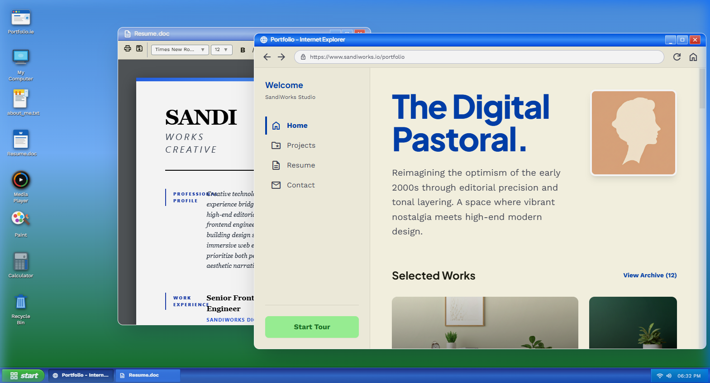

# SandiOS™ - The Digital Pastoral Portfolio 🌿

Welcome to **SandiOS™**, a premium web-based desktop environment and portfolio for **SandiWorks Studio**. This project reimagines the optimism of the early 2000s (specifically Windows XP) through high-end modern frontend engineering.

## 🚀 Experience
*   **Immersive OS Interface**: A fully functional Windows XP-style UI with draggable windows, taskbar, and start menu.
*   **SandiWorks Portfolio**: A modern "Internet Explorer" style browser showcasing creative projects.
*   **Premium Resume**: A high-fidelity, editorial-style professional document viewer.
*   **Authentic Visuals**: Legacy-accurate typography, inline SVG icons, and a custom context menu.

## 🛠️ Tech Stack
*   **Framework**: [React](https://reactjs.org/) + [Vite](https://vitejs.dev/)
*   **Styling**: [Tailwind CSS](https://tailwindcss.com/)
*   **State Management**: [Zustand](https://github.com/pmndrs/zustand)
*   **Window Management**: [react-rnd](https://github.com/bokuweb/react-rnd)

## 📸 Inside the Apps

## ⚙️ Development
1.  **Install dependencies**: `npm install`
2.  **Run development server**: `npm run dev`
3.  **Build for production**: `npm run build`

---
© 2026 SandiWorks Creative — Built with precision and nostalgia.
